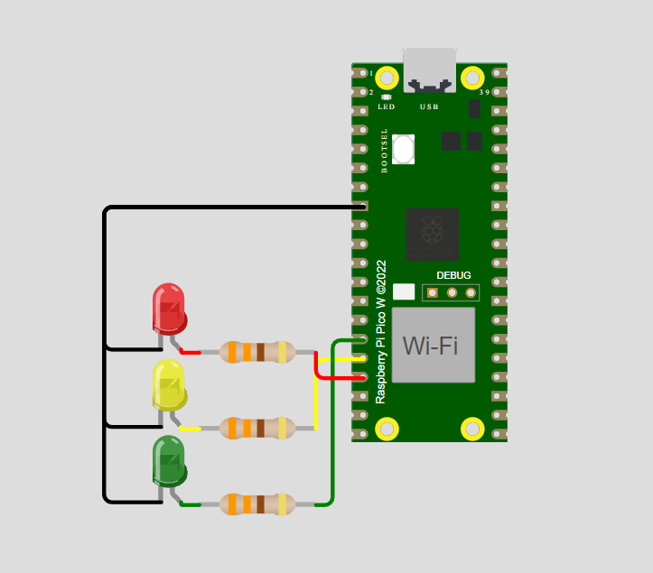

# Projeto Semáforo com Raspberry Pi Pico W

Repositório para a tarefa sobre temporização e clock do Raspberry Pi Pico W, do curso de capacitação Embarcatech.

## Descrição
Este projeto utiliza um Raspberry Pi Pico W para simular o funcionamento de um semáforo. Ele controla LEDs para representar as luzes verde, amarela e vermelha de um semáforo real.



## Pré-requisitos

1. **Instalar o SDK do Raspberry Pi Pico**:
   - Siga as instruções no [site oficial](https://github.com/raspberrypi/pico-sdk) para instalar o SDK do Raspberry Pi Pico.

2. **Instalar o CMake**:
   - Baixe e instale o CMake a partir do [site oficial](https://cmake.org/download/).

3. **Instalar o Ninja**:
   - Baixe e instale o Ninja a partir do [site oficial](https://ninja-build.org/).

## Instalação e Configuração
1. Clone este repositório:
    ```bash
    git clone https://github.com/dev-leonunes/raspberrypi-semaforo.git
    cd raspberrypi-semaforo
    ```
2. Configurar o ambiente no Visual Studio Code:
    - Abra o Visual Studio Code no diretório do projeto.
    - Certifique-se de que as configurações no arquivo ``settings.json`` estão corretas e apontam para os caminhos corretos do SDK, CMake, Ninja, etc.

## Como utilizar

1. **Compilar o projeto**:
    - No Visual Studio Code, abra a extensão Raspberry Pi Pico Project, procure e selecione a função ``Compile Project``.

2. **Execute o projeto**:
    - Retorne aos arquivos do projeto, abra o arquivo ``diagram.json``, clique no botão verde ``Start the simulation``.

3. **Visualizar a simulação do semáforo com temporização entre os LEDs**:

## Estrutura do Projeto

- ``.vscode``: Diretório contendo configurações do Visual Studio Code.
- ``build``: Diretório onde os arquivos compilados serão gerados.
- ``CMakeLists.txt``: Arquivo de configuração do CMake para o projeto.
- ``raspberrypi-semaforo.c``: Código fonte principal do projeto.
- ``diagram.json``: Diagrama de conexões dos componentes.
- ``wokwi.toml``: Arquivo de configuração para simulação no Wokwi.
- ``pico_sdk_import.cmake``: Arquivo de importação do SDK do Raspberry Pi Pico.

## Contribuição
1. Faça um fork do projeto.
2. Crie uma nova branch:
    ```bash
    git checkout -b minha-nova-feature
    ```
3. Faça commit das suas alterações:
    ```bash
    git commit -m 'Adiciona nova feature'
    ```
4. Envie para o repositório remoto:
    ```bash
    git push origin minha-nova-feature
    ```
5. Abra um Pull Request.
